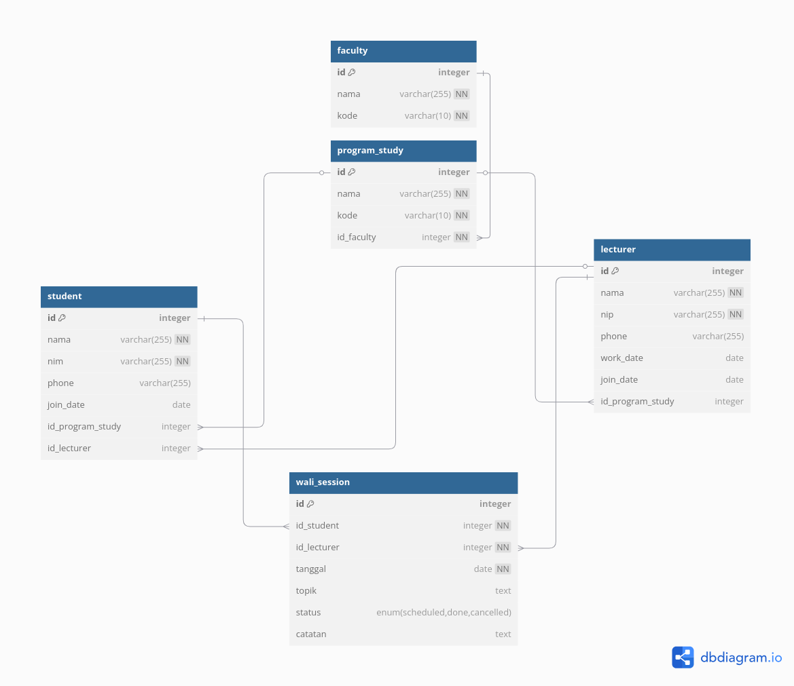

# TP8DPBO2025C2
Saya Zaki Adam dengan NIM 2304934 mengerjakan Tugas Praktikum 8 dalam mata kuliah Desain dan Pemrograman Berorientasi Objek untuk keberkahan-Nya maka saya tidak akan melakukan kecurangan seperti yang telah dispesifikasikan. Aamiin.

# Perwalian Management System
Sebuah aplikasi berbasis web modular menggunakan PHP untuk mengelola

---
## Desain Program

## 📘 Entitas dan Relasi dalam Database
### 1. **faculty**
- **Deskripsi:** Menyimpan data fakultas dalam universitas.
- **Kolom:**
    - `id` (PK): ID unik untuk fakultas.
    - `nama`: Nama fakultas.
    - `kode`: Kode singkat fakultas.
### 2. **program_study**
- **Deskripsi:** Menyimpan data program studi (jurusan) yang berada di bawah fakultas.
- **Kolom:**
    - `id` (PK): ID unik untuk program studi.
    - `nama`: Nama program studi.
    - `kode`: Kode program studi.
    - `id_faculty` (FK → `faculty.id`): Menunjukkan program studi ini berada di fakultas mana.
### 3. **lecturer**
- **Deskripsi:** Menyimpan data dosen sebagai pembimbing atau wali mahasiswa.
- **Kolom:**
    - `id` (PK): ID unik untuk dosen.
    - `nama`: Nama dosen.
    - `nip`: Nomor induk pegawai.
    - `phone`: Nomor telepon dosen.
    - `work_date`: Tanggal mulai kerja.
    - `join_date`: Tanggal mulai menjadi wali.
    - `id_program_study` (FK → `program_study.id`): Relasi ke program studi tempat dosen mengajar.
### 4. **student**
- **Deskripsi:** Menyimpan data mahasiswa.
- **Kolom:**
    - `id` (PK): ID unik untuk mahasiswa.
    - `nama`: Nama mahasiswa.
    - `nim`: Nomor induk mahasiswa.
    - `phone`: Nomor telepon mahasiswa.
    - `join_date`: Tanggal masuk kuliah.
    - `id_program_study` (FK → `program_study.id`): Program studi mahasiswa.
    - `id_lecturer` (FK → `lecturer.id`): Dosen wali mahasiswa tersebut.
### 5. **wali_session**
- **Deskripsi:** Menyimpan data sesi bimbingan antara mahasiswa dan dosen wali.
- **Kolom:**
    - `id` (PK): ID unik sesi.
    - `id_student` (FK → `student.id`): Mahasiswa yang mengikuti sesi.
    - `id_lecturer` (FK → `lecturer.id`): Dosen yang membimbing.
    - `tanggal`: Tanggal sesi bimbingan.
    - `topik`: Topik pembahasan sesi.
    - `status`: Status sesi (`scheduled`, `done`, `cancelled`).
    - `catatan`: Catatan tambahan sesi bimbingan.
---
## 📊 Relasi Antar Tabel

| Relasi                                         | Deskripsi                                           |
| ---------------------------------------------- | --------------------------------------------------- |
| `program_study.id_faculty → faculty.id`        | Banyak program studi berada di bawah satu fakultas. |
| `lecturer.id_program_study → program_study.id` | Banyak dosen dapat berasal dari satu program studi. |
| `student.id_program_study → program_study.id`  | Mahasiswa terdaftar pada satu program studi.        |
| `student.id_lecturer → lecturer.id`            | Mahasiswa memiliki satu dosen wali.                 |
| `wali_session.id_student → student.id`         | Satu sesi mengaitkan satu mahasiswa.                |
| `wali_session.id_lecturer → lecturer.id`       | Satu sesi juga mengaitkan satu dosen wali.          |
## 📁 Struktur Folder Proyek PHP Native
Dokumen ini menjelaskan fungsi masing-masing folder yang digunakan dalam struktur proyek PHP native sebagai bagian dari dokumentasi teknis.

---
### 📂 `config/`
Berisi konfigurasi koneksi proyek dengan MariaDB.
- Terdiri atas file `db.php`, yang menyimpan informasi kredensial user database dan nama database yang digunakan dalam proyek.
- File ini menjadi pusat konfigurasi koneksi database yang digunakan oleh seluruh komponen aplikasi.
### 📂 `models/`
Berisi kelas-kelas (class) yang bertanggung jawab untuk interaksi langsung dengan basis data.  
File yang terdapat di folder ini:
- `faculty.class.php` 
- `lecturer.class.php`
- `program_study.class.php`
- `student.class.php`
- `wali_session.class.php`
Setiap kelas memiliki metode standar berikut:
- `__construct()`  
    Menginstansiasi objek model dan mendefinisikan koneksi ke database menggunakan objek dari `db.php`.
- `getAll()`  
    Mengambil seluruh data dari tabel yang bersangkutan.
- `getById($id)`  
    Mengambil data berdasarkan ID tertentu.
- `add($data)`  
    Menambahkan data baru ke tabel.
- `update($id, $data)`  
    Memperbarui data berdasarkan ID tertentu.
- `delete($id)`  
    Menghapus data dari tabel.
    
### 📂 `controllers/`
Berisi kelas-kelas yang mengatur alur logika aplikasi dan menjembatani antara model dan view.  
File yang terdapat di folder ini:
- `faculty.controller.php`
- `lecturer.controller.php`
- `program_study.controller.php`
- `student.controller.php`
- `wali_session.controller.php`
Setiap kelas controller memiliki metode berikut:
- `__construct()`  
    Menginstansiasi objek dari model dan view yang terkait.
- `index()`  
    Mengambil seluruh data melalui `getAll()` dari model dan meneruskannya ke `renderList()` di view.
- `create()`  
    Menangani request untuk menambahkan data baru. Jika ada data POST, data akan dikirim ke `add()` dari model, kemudian ditampilkan form input melalui `renderForm()`.
- `edit($id)`  
    Menangani request untuk mengedit data berdasarkan ID. Jika terdapat data POST, data dikirim ke `update()` dari model. Form akan ditampilkan dengan nilai default dari data sebelumnya melalui `renderForm()`.
- `delete($id)`  
    Menangani request untuk menghapus data berdasarkan ID.
    
### 📂 `views/`
Berisi kelas-kelas yang bertanggung jawab atas penyajian data kepada pengguna.
File utama:
- `base.view.php` (sebagai kelas induk)
- `faculty.view.php`, `lecturer.view.php`, `program_study.view.php`, `student.view.php`, `wali_session.view.php` (mewarisi `base.view.php`)
- 
#### `base.view.php` memiliki metode:
- `__construct()`  
    Konstruktor utama.
- `renderList($data)`  
    Membuat tabel data secara dinamis berdasarkan struktur dari `getColumns()`.
- `renderForm($data)`  
    Membuat formulir input secara dinamis berdasarkan `getFormFields()`.
    
#### Kelas turunan (`faculty.view.php`, dll.) memiliki metode:
- `__construct()`  
    Konstruktor kelas turunan.
- `getColumns()`  
    Mendefinisikan struktur kolom tabel.
- `getFormFields()`  
    Mendefinisikan struktur input/form.
    
##### Tambahan (jika ada relasi antar tabel):
- `renderTableList()`  
    Ekstensi dari `renderList()` untuk menampilkan kolom dari tabel relasi (foreign key).
- `renderTableForm()`  
    Ekstensi dari `renderForm()` untuk menampilkan input yang terhubung ke foreign key dari tabel lain.
    
### 📂 `public/`
Berisi file statis seperti:
- JavaScript
- CSS
- Gambar atau asset lainnya
> Folder ini digunakan untuk menyimpan seluruh file yang akan diakses secara langsung oleh pengguna akhir melalui browser.
- 
### 📂 `templates/`
Berisi elemen-elemen HTML yang bersifat _reusable_ seperti:
- `list.html`
- `form.html`
> Template ini memudahkan pengelolaan layout antarmuka pengguna yang konsisten di seluruh halaman aplikasi.

## Penjelasan Alur Program
### 🗂️ 1. **List.html**

Halaman ini berfungsi sebagai _landing page_ dan titik akses utama ke seluruh modul dalam sistem.

#### Fitur Utama:
- **Navigasi**:
    - Terdapat _top bar_ yang memungkinkan pengguna untuk mengakses berbagai entitas data seperti:
        - **Fakultas**
        - **Program Studi**
        - **Dosen**
        - **Mahasiswa**
        - **Perwalian**
- **Tabel Data**:
    - Setiap menu menampilkan data dalam bentuk tabel.
    - Setiap baris data memiliki dua aksi utama:
        - **Edit**: Untuk mengubah data.
        - **Delete**: Untuk menghapus data.
- **Penambahan Data**:
    - Tersedia tombol **“Add New”** yang mengarahkan pengguna ke halaman form untuk input data baru.

### 📝 2. **Form.html**
Halaman form digunakan untuk input dan modifikasi data pada entitas tertentu.
#### Fitur Utama:
- **Edit Mode**:
    - Saat pengguna menekan tombol **Edit** dari `List.html`, form akan menampilkan **data yang telah diisi sebelumnya**.
    - Hal ini memungkinkan pengguna melihat dan memperbarui data yang sudah ada.
- **Add Mode**:
    - Jika tombol **“Add New”** ditekan, form akan tampil dalam keadaan kosong agar pengguna dapat mengisi data baru.

### ⚙️ 3. **Struktur dan Mekanisme File PHP (Contoh: `main.php`)**

Setiap entitas memiliki satu file PHP masing-masing, seperti:
- `index.php`
- `lecturer.php`
- `prodi.php`
- `student.php`
- `wali_session.php`
#### Struktur Umum dan Fungsionalitas:
1. **Error Handling**
    - Menangani kesalahan ketika pengguna mencoba menghapus data yang **masih digunakan oleh tabel lain** (integritas referensial).
2. **`create()`**
    - Memanggil _controller_ untuk membuat entitas/data baru ke dalam basis data.
3. **`update()`**
    - Memanggil _controller_ untuk memperbarui data berdasarkan input dari form.
4. **`delete()`**
    - Memanggil _controller_ untuk menghapus data dari database.
    - Termasuk pengecekan apakah data tersebut masih memiliki relasi dengan entitas lain.
5. **`index()`**
    - Menampilkan seluruh data dalam tabel ke dalam tampilan `List.html`.

## Dokumentasi
